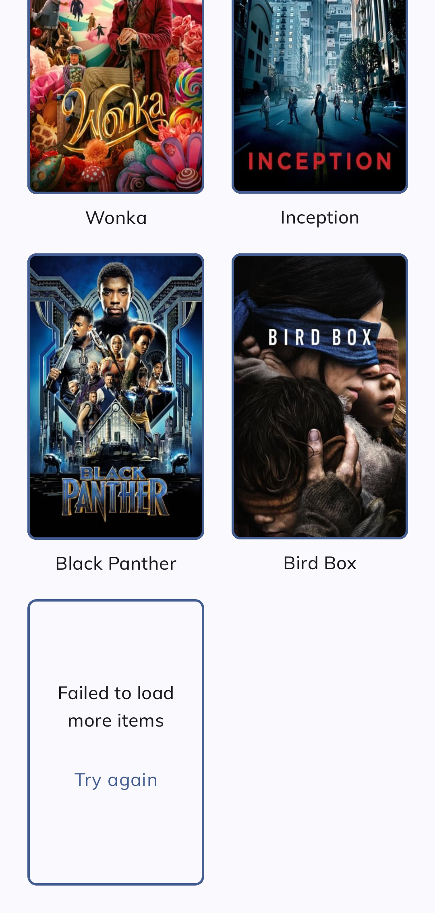
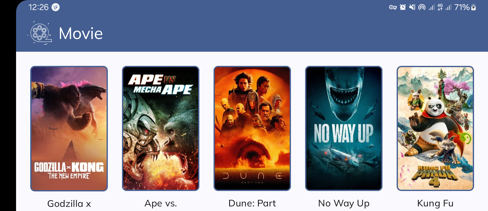
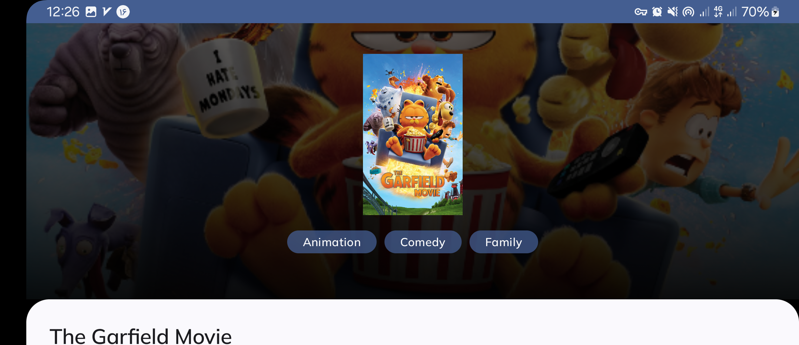
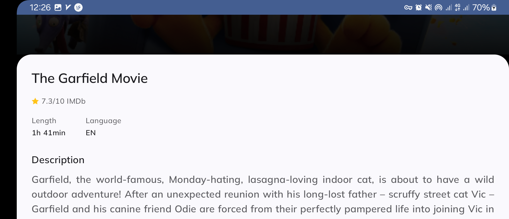

# Movie app
Sample Android app to show popular movies using themoviedb api.
   
# Tech Stack
- Compose
- Retrofit
- Room
- DataStore
- Coroutine
- Paging 3
- Hilt
- Lottie
- Coil

- MVVM Architecture

# Screen shots

    
    
    
    
    
    
    
 

